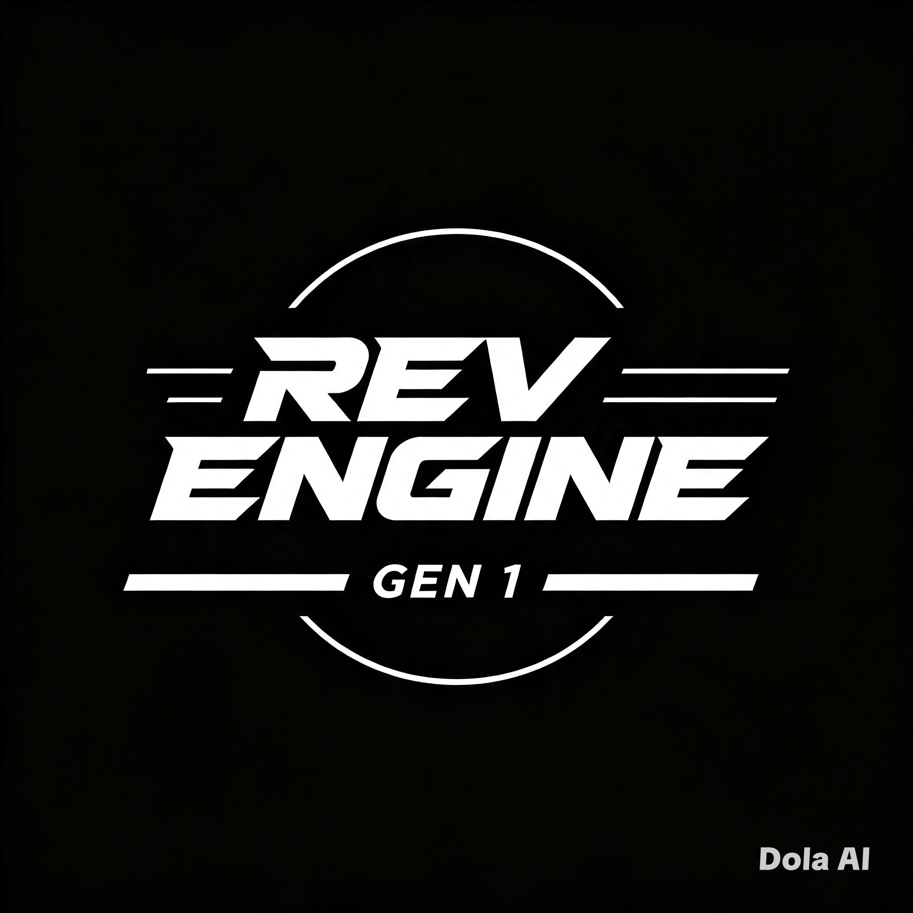

<html lang="id">
<head>
<meta charset="UTF-8">
<meta name="viewport" content="width=device-width, initial-scale=1.0">
<title>REV Engine — Gen 1 | Mod Engine untuk Minecraft</title>
<link rel="icon" type="image/png" href="favicon.png">
<link rel="preconnect" href="https://fonts.googleapis.com">
<link href="https://fonts.googleapis.com/css2?family=Oswald:wght@500;600;700&family=Inter:wght@400;500;600;700&family=JetBrains+Mono:wght@400;500;700&display=swap" rel="stylesheet">

</head>
<body>

<header>
  <nav>
    
REV ENGINE

    

      <a href="#cara-kerja">Cara Kerja</a>
      <a href="#roadmap">Roadmap</a>
      <a href="#wizard">Ekspor Mod</a>
    

    <a class="cta-nav" href="#wizard">Coba Wizard</a>
  </nav>
</header>

<section class="hero">
  
 MOD ENGINE UNTUK MINECRAFT

  <h1>
    REV
    ENGINE
  </h1>
  
GEN 1 — DESAIN 3D → MOD MINECRAFT

  
Desain aset 3D dengan mudah, lalu rakit langsung jadi mod Minecraft — dari satu mesin yang sama, tanpa pindah alat.

  

    <a href="#wizard" class="btn btn-hot">Coba Wizard Ekspor</a>
    <a href="#roadmap" class="btn btn-ghost">Lihat Roadmap Gen</a>
  

  

    <svg id="tach" viewBox="0 0 500 300">
      <path d="M 60 260 A 190 190 0 0 1 145 95" fill="none" stroke="#6fffb0" stroke-width="14" stroke-linecap="round" opacity="0.85"/>
      <path d="M 155 87 A 190 190 0 0 1 345 87" fill="none" stroke="#ffb020" stroke-width="14" stroke-linecap="round" opacity="0.85"/>
      <path d="M 355 95 A 190 190 0 0 1 440 260" fill="none" stroke="#ff5a1f" stroke-width="14" stroke-linecap="round" opacity="0.9"/>
      <text x="95" y="290" class="tach-label">GEN 1</text>
      <text x="235" y="60" class="tach-label">GEN 2</text>
      <text x="392" y="290" class="tach-label">GEN 3 · AI</text>
      <g class="tach-needle" id="tachNeedle" style="transform:rotate(-58deg);">
        <line x1="250" y1="250" x2="250" y2="105" stroke="#f2f0eb" stroke-width="4" stroke-linecap="round"/>
        <circle cx="250" cy="250" r="10" fill="#f2f0eb"/>
      </g>
      <text x="250" y="240" text-anchor="middle" class="tach-readout" id="tachReadout">GEN 1 · AKTIF</text>
    </svg>
  

</section>

<section class="how" id="cara-kerja">
  

    ALUR KERJA
    <h2>Dari desain sampai jadi mod</h2>
    
Tiga tahap dalam satu mesin — tidak perlu berpindah aplikasi.

  

  

    

      
<b class="mono">TAHAP · IDLE</b>

      <h3>Desain 3D</h3>
      
Bangun aset 3D untuk Minecraft langsung di editor REV Engine — blok, entitas, item, sampai struktur custom.

    

    

      
<b class="mono">TAHAP · REV</b>

      <h3>Rakit Mod</h3>
      
Aset yang sudah dibuat langsung dirakit jadi paket mod — behavior, tekstur, dan model tersusun otomatis.

    

    

      
<b class="mono">TAHAP · REDLINE</b>

      <h3>Ekspor</h3>
      
Pilih Bedrock atau Java, pilih versi, dan unduh langsung ke perangkat sebagai file .mcaddon.

    

  

</section>

<section id="roadmap">
  

    ROADMAP
    <h2>Tiga generasi, satu mesin</h2>
    
Setiap generasi menaikkan putaran mesin — makin tinggi, makin otomatis.

  

  

    

      
ZONA IDLE

      <h3>Gen 1</h3>
      
Editor desain 3D manual untuk Minecraft, lalu ekspor mod ke Bedrock atau Java lewat wizard.

      ● AKTIF SEKARANG
    

    

      
ZONA REV

      <h3>Gen 2</h3>
      
Mesin bisa membantu men-generate dan meningkatkan kualitas desain otomatis — hasil lebih rapi dan lebih keren.

      ○ TAHAP BERIKUTNYA
    

    

      
ZONA REDLINE

      <h3>Gen 3</h3>
      
AI 3D Desain built-in. Ketik prompt, dan mesin langsung merakitnya jadi mod Minecraft yang siap diunduh.

      ○ MASA DEPAN
    

  

</section>

<section class="demo" id="wizard">
  

    DEMO INTERAKTIF
    <h2>Wizard ekspor mod</h2>
    
Empat tahap singkat dari pilihan platform sampai file terunduh ke perangkatmu.

  

  

    

      
TAHAP 1 · PLATFORM

      
1 / 4

    

    

      

      

      

      

    

    

      <!-- STEP 1 -->
      

        
Pilih platform

        
Mod akan dirakit sesuai format platform yang dipilih.

        

          <button class="choice" data-field="platform" data-value="Bedrock">
            <b>Bedrock</b>
            Android, iOS, Windows, konsol
          </button>
          <button class="choice" data-field="platform" data-value="Java">
            <b>Java</b>
            PC (Java Edition)
          </button>
        

      

      <!-- STEP 2 -->
      

        
Pilih versi

        
Sesuaikan mod dengan versi Minecraft target.

        

          <label class="mono">VERSI MINECRAFT</label>
          <select id="versionSelect">
            <option value="1.21.x">1.21.x</option>
            <option value="1.20.x">1.20.x</option>
            <option value="1.19.x">1.19.x</option>
            <option value="1.18.x">1.18.x</option>
          </select>
        

        <label class="checkbox-row">
          <input type="checkbox" id="allVersions"> Terapkan ke semua versi (All Version)
        </label>
      

      <!-- STEP 3 -->
      

        
Favicon mod

        
Unggah favicon.png sebagai ikon mod.

        <label class="file-drop">
          Pilih favicon.png…
          PILIH FILE
          <input type="file" id="faviconInput" accept="image/png">
        </label>
        

          
          
        

      

      <!-- STEP 4 -->
      

        
Konfirmasi

        
Periksa kembali sebelum mengunduh ke perangkat.

        

          
PLATFORM—

          
VERSI—

          
FAVICON—

          
OUTPUT.mcaddon

        

      

    

    
Pilih salah satu untuk lanjut.

    

      <button class="btn btn-ghost btn-sm" id="btnBack">Kembali</button>
      <button class="btn btn-hot btn-sm btn-disabled" id="btnNext">Lanjut</button>
    

    
File akan diunduh sebagai *.mcaddon ke perangkatmu.

  

</section>

<footer>
  

  
REV Engine Gen 1 — Mod engine untuk Minecraft. Gen 2 &amp; Gen 3 dalam pengembangan.

</footer>

</body>
</html>

